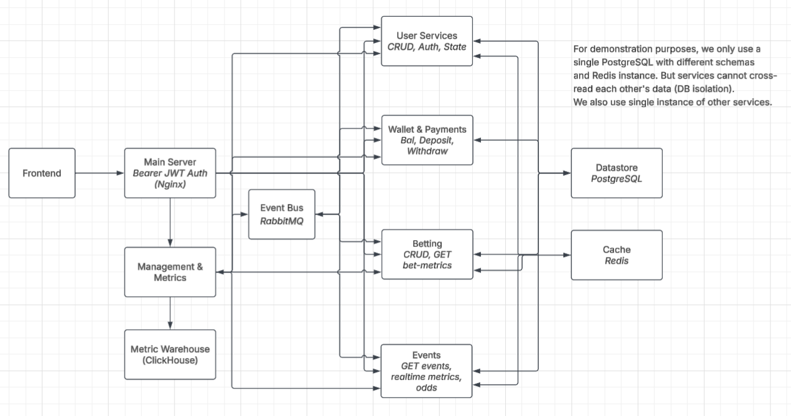

# System Architecture Specification: Production-Simulation Betting Platform

This document outlines the high-level architecture, event-driven design, infrastructure constraints, and directory layout for the full-scale production simulation of our sports betting platform. The system is designed using **Rust** for maximum performance and memory safety, utilizing an **Event-Driven Architecture (EDA)** over a single-node **Docker Swarm** environment.

---

## 1. System Architecture Overview

The architecture transitions from traditional tight coupling to an asynchronous, decoupled system. Services isolate their domain data through logical database schemas and communicate exclusively via an asynchronous message broker, except for fast read-heavy queries served directly via an in-memory cache.



```mermaid
flowchart LR
    %% Client & Gateway Layer
    FE[Frontend] --> API[Main Server<br>Bearer JWT Auth<br>Nginx]

    %% Main API Routing to Microservices
    API --> US[User Services<br>CRUD, Auth, State]
    API --> WP[Wallet & Payments<br>Bal, Deposit, Withdraw]
    API --> BET[Betting<br>CRUD, GET bet-metrics]
    API --> EV[Events<br>GET events, realtime metrics, odds]
    API --> MM[Management & Metrics]

    %% External Services
    WP <--> PG[Payment Gateway<br>Withdraw/Deposit]
    EV <--> OS[Odds Supplier<br>Odds feed]

    %% Async Message Bus Connections
    EB[Event Bus<br>RabbitMQ]
    EB <--> US
    EB <--> WP
    EB <--> BET
    EB <--> EV

    %% Management & Metrics Warehouse
    MM --> MW[Metric Warehouse<br>ClickHouse]
    MM --> EB

    %% Data Layer
    DB[(Datastore<br>PostgreSQL)]
    CACHE[(Cache<br>Redis)]

    %% Notification Service
    EB <--> NS[Notification Service]
    NS -->|publish notification| NWWS[Notification Worker (websocket)]
    NS <--|client subsribe to notification, e.g. specific odds| NWWS
    CACHE -->|direct odds read from Redis| NWWS

    US <--> DB
    WP <--> DB
    BET <--> DB
    EV <--> DB

    US <--> CACHE
    BET <-- CACHE %% Read odds
    EV <--> CACHE
```

For demonstration purposes, we only use a single PostgreSQL with different schemas and a Redis instance. But services cannot cross-read each other's data (DB isolation).

---

## 2. Component Specifications

### 2.1 Edge & Routing Layer

- **Main Server (Nginx):** Acts as the reverse proxy and API Gateway. It is responsible for SSL termination, global rate-limiting, and stateless **Bearer JWT Authentication** verification. Valid requests are proxied internally to the corresponding application service.

### 2.2 Application Services (Rust Backend)

Every service is implemented as an independent Rust binary utilizing the high-performance async framework `actix-web`.

- **User Services:** Manages registration, logins, and profile state.
- **Wallet & Payments:** Coordinates the strict financial ledger. Responsible for balancing deposits, withdrawals, and locking funds. It interacts solely with the database layer using explicit **pessimistic database locks** to prevent race conditions or double-spending (ACID compliance).
- **Betting Service:** Orchestrates the lifecycle of a bet (Pending $\rightarrow$ Confirmed $\rightarrow$ Settled). It acts as a Saga coordinator or workflow controller using event state flags.
- **Events Service:** Exposes fast read-only APIs for match data and current odds. It processes inbound mock odds feeds and constantly pushes updates out via WebSockets. When an event is online/avaiable for betting, its odds must be published to Redis (odds:event_id).
- **Notification Service:** Communication with user frontend via WebSocket: user subscribe to events, worker push notifications.
- **Management & Metrics:** Exposes APIs for management and metrics.

### 2.3 Event Bus & Messaging Layer

- **RabbitMQ:** Serves as our asynchronous central nervous system. Services never call each other. Instead, workflows execute sequentially via published events.
  - _Example Placement Flow:_ `Betting` saves a `Pending` state $\rightarrow$ Publishes `BetRequested` to RabbitMQ $\rightarrow$ `Wallet` consumes message and safely reserves balance $\rightarrow$ `Wallet` publishes `FundsLocked` $\rightarrow$ `Betting` switches state to `Confirmed`.

### 2.4 Persistent & Cache Layer

- **Datastore (PostgreSQL):** A single robust instance containing separated **Logical Schemas** per domain microservice (`users_schema`, `wallet_schema`, `bets_schema`). Cross-schema reads or modifications inside application logic are strictly forbidden to ensure schema boundary isolation.
- **Cache (Redis):** Handles transient state and high read data (such as live odds feeds). The **Wallet & Payments** service avoids Redis to ensure financial data retains maximum transactional consistency directly via Postgres.
- **Metric Warehouse (ClickHouse):** A dedicated column-oriented database optimized for analytics. Logging streams, tracking metrics, and historical line modifications are processed out of RabbitMQ and into ClickHouse to avoid overloading PostgreSQL.

### 2.5 The Nginx "Fast Path" for Odds

- **The Concept:** For a high-throughput betting site, a common production trick is to configure Nginx (often using OpenResty or Kong) to read directly from Redis for public, unauthenticated routes.

- **The Result:** When 10,000 users refresh the odds page, the request never even touches your Rust Events service. Nginx serves the JSON straight from Redis memory.

### 2.6 Mock External Service

- Payment Gateway: Withdraw/Deposit. Mock with delays and random failures. (use their own portal and callback url)
- Odds Supplier

---

## 3. Infrastructure & Orchestration (Docker Swarm)

To simulate full-scale datacenter isolation on a single physical host machine, we configure a single-node **Docker Swarm**.

- **Network Strategy:** Services are joined across an abstract **Overlay Network** (`driver: overlay`). This allows containers to find one another natively using Docker's internal DNS resolution (e.g., connecting a database string via `postgres://db-host:5432`) without exposing high-risk system ports directly to the physical machine host interface.
- **Process Resilience:** High Availability is managed via systemic restart policies. If an application process crashes or panics, the orchestrator handles process reinitialization natively without manual intervention.
- **Image Management:** Because Docker Swarm operates over stack deployments, deployment execution ignores implicit local `build:` attributes. Application images must be compiled locally and written directly into the local daemon image cache prior to launching deployments.

---

## 4. API Specifications

API specs are displayed with Swagger UI at `/api/swagger` (hosted by Management Service) and autogenerated using `utoipa`.

| Service              | Endpoint                                    | Description                                                  | Authentication   |
| -------------------- | :------------------------------------------ | :----------------------------------------------------------- | :--------------- |
| User Service         | `POST /api/v1/auth/verify`                  | Verify a JWT and returns decoded http headers with user info | \_               |
| User Service         | `POST /api/v1/auth/register`                | Register a new user                                          | \_               |
| User Service         | `POST /api/v1/auth/login`                   | Login with username and password (Salting and Hashing)       | \_               |
| User Service         | `GET /api/v1/users/:id`                     | Get user profile                                             | Bearer JWT       |
| User Service         | `PUT /api/v1/users/:id`                     | Update user profile                                          | Bearer JWT       |
| User Service         | `DELETE /api/v1/users/:id`                  | Delete user                                                  | Bearer JWT       |
| User Service         | `GET /api/v1/users`                         | Get all users                                                | Bearer JWT/Admin |
| Wallet Service       | `GET /api/v1/wallet/:id`                    | Get wallet balance                                           | Bearer JWT       |
| Wallet Service       | `POST /api/v1/wallet/:id/deposit`           | Deposit funds (simulated)                                    | Bearer JWT       |
| Wallet Service       | `POST /api/v1/wallet/:id/withdraw`          | Withdraw funds (simulated)                                   | Bearer JWT       |
| Event Service        | `GET /api/v1/events`                        | Get all events (simulated)                                   | \_               |
| Event Service        | `GET /api/v1/events/:id`                    | Get event details (simulated)                                | \_               |
| Event Service        | `GET /api/v1/events/:id/odds`               | Get event odds (simulated)                                   | \_               |
| Betting Service      | `POST /api/v1/bets`                         | Place a bet                                                  | Bearer JWT       |
| Betting Service      | `DELETE /api/v1/bets/:id`                   | Cancel a bet                                                 | Bearer JWT       |
| Betting Service      | `GET /api/v1/bets/event/:id`                | Get bet metrics for event                                    | Bearer JWT       |
| Betting Service      | `GET /api/v1/bets/user/:id`                 | Get all bets by user                                         | Bearer JWT       |
| Management Service   | `GET /api/v1/management/metrics`            | Get metrics                                                  | Bearer JWT/Admin |
| Management Service   | `POST /api/v1/management/users/add`         | Add an user                                                  | Bearer JWT/Admin |
| Management Service   | `DELETE /api/v1/management/users/:id`       | Delete an user                                               | Bearer JWT/Admin |
| Management Service   | `POST /api/v1/management/events/add`        | Add an event                                                 | Bearer JWT/Admin |
| Management Service   | `DELETE /api/v1/management/events/:id`      | Delete an event                                              | Bearer JWT/Admin |
| Management Service   | `POST /api/v1/management/events/:id/settle` | Settle an event                                              | Bearer JWT/Admin |
| All                  | `GET /api/v1/management/swagger`            | Get API specifications                                       | Bearer JWT/Admin |
| Notification Service | `RABBITMQ notification.push`                | Notify a user                                                | Internal         |

> `/Admin` &mdash; for admin only

Bearer JWT with asymetric signature verification:

```json
{
  "header": {
    "alg": "RS256",
    "typ": "JWT"
  },
  "payload": {
    "sub": "1234567890",
    "username": "JohnDoe",
    "role": "admin",
    "iat": 1516239022,
    "exp": 1516239022
  },
  "signature": "..."
}
```

APIs are intended for public access via Nginx reverse proxy.
Services shouldn't directly communicate with one another
but instead use Saga pattern with RabbitMQ as event bus for
internal messaging.

---

## 5. Directory Blueprint & Folder Structure

```text
<PROJECT_ROOT>/
├── .gitignore
├── README.md
├── docker-compose.yml              # Central stack composition layout for Swarm
├── Makefile                        # Tooling scripts for building images and starting stack
├── config/                         # Global configuration presets
│   ├── nginx.conf                  # Gateway configurations and JWT verification definitions
│   └── rabbitmq.conf               # Event bus queue configurations
│
├── src/                            # Isolated application domain containers
│   ├── frontend/                   # React application
│   ├── user-service/
│   │   ├── Cargo.toml
│   │   ├── Dockerfile
│   │   └── src/
│   │
│   ├── wallet-service/
│   │   ├── Cargo.toml
│   │   ├── Dockerfile
│   │   └── src/
│   │
│   ├── betting-service/
│   │   ├── Cargo.toml
│   │   ├── Dockerfile
│   │   └── src/
│   │
│   └── events-service/
│       ├── Cargo.toml
│       ├── Dockerfile
│       └── src/
└── migrations/                     # Data initialization mappings
    ├── postgres/                   # Schema separation initializations
    │   ├── 0001_init_user_schema.sql
    │   ├── 0002_init_wallet_schema.sql
    │   ├── 0003_init_bets_schema.sql
    │   └── 0004_init_events_schema.sql
    └── clickhouse/                 # Columnar layout definitions
        └── 0001_init_metrics.sql

```

---

## 6. Deployment Orchestration Blueprint

To launch this architecture onto the single-node cluster environment, deployment scripts wrap the underlying configurations into unified execution steps.

1. **Initialize Swarm Environment:**

```bash
docker swarm init

```

2. **Seed Secure Passphrases:**

```bash
echo "SuperSecretProductionPassword" | docker secret create db_password -

```

3. **Compile Services:**

```bash
docker build -t local/betting-service:latest ./src/betting-service

```

4. **Launch Stack Infrastructure:**

```bash
docker stack deploy -c docker-compose.yml betting_system

```
